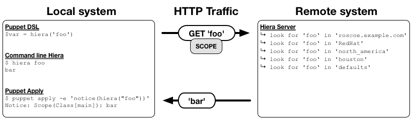

Note: This project is no longer relevant in the world of Hiera 5, which can resolve the full scope in a single request.

# Hiera Server

Hiera Server separates the query and the data retrieval into separate processes.
The *server* portion runs on a remote machine and uses any configured Hiera
backend to retrieve data. The *client* portion simply runs as a backend on the
local machine and forwards requests to the server. Facilities are provided to
configure the data lookup on the server from either end, allowing the server to
provide data to more than one client using different configurations.

Rather than making multiple HTTP requests, the client will send the full scope
and any relevant configuration to the server as part of a single request. The
server will perform the data lookup and return a single response.

SSL is currently untested, as this is a POC. My next step is to validate client
and server certificates so this can be used for something worthwhile.

## Significance

In a standard `hiera()` lookup, Hiera will walk the entire hierarchy, querying
each level until it gets an answer, or exhausts options. I'll provide a few
examples using this hierarchy:

    :hierarchy:
      - "%{clientcert}"
      - "%{osfamily}"
      - "%{region}"
      - "%{datacenter}"
      - defaults

A simple lookup will result in many queries, such as:

    hiera('foo')
     ↳ look for 'foo' in 'roscoe.example.com.yaml'
     ↳ look for 'foo' in 'RedHat.yaml'
     ↳ look for 'foo' in 'north_america.yaml'
     ↳ look for 'foo' in 'houston.yaml'
     ↳ look for 'foo' in 'defaults.yaml'

This seems like a lot, but on a local filesystem, it makes perfect sense. They're
all cached into RAM by the kernel and lookups are very fast. It doesn't make as
much sense when you drop a REST API into the picture.

    hiera('foo')
     ↳ http://configdb.example.com/query?key=foo&source=roscoe.example.com
                                                404 Not Found ↩︎
     ↳ http://configdb.example.com/query?key=foo&source=RedHat
                                                404 Not Found ↩︎
     ↳ http://configdb.example.com/query?key=foo&source=north_america
                                                404 Not Found ↩︎
     ↳ http://configdb.example.com/query?key=foo&source=houston
                                                404 Not Found ↩︎
     ↳ http://configdb.example.com/query?key=foo&source=defaults
                                                       'bar' ↩︎

That's a lot of HTTP calls, each adding latency!

This Hiera Server gem instead sends the full scope along with a single request.
The server will walk the hierarchy and do all the lookups server-side, before
returning a single response.

The side benefit to this method is that all existing Hiera backends will work
transparently without the need for adaptation.

## Installation

Install the gem in the proper GEMPATHs on both the local and remote systems.

### Local system (the Puppet master or machine running `puppet apply`)

For the Puppet master to be able to use this gem, you'll need to install it into
the Puppet master's GEMPATH. If you're using Puppetserver or PE, you'll want to
install it like such:

    $ /opt/puppetlabs/bin/puppetserver gem install hiera_server

To be able to access it from the command line, as in CLI `hiera` or `puppet apply`,
you'll need to also install it into the Puppet GEMPATH, such as:

    $ /opt/puppetlabs/puppet/bin/gem install hiera_server

If you're using Passenger or Webrick, you'll only need to install it once, as the
GEMPATH are typically shared by the master and agent.

### Remote system (the machine running the Hiera server)

This machine doesn't necessarily need to be a Puppet master, but it will need Hiera
properly installed and configured. Simply install the gem into the Puppet GEMPATH.

    $ /opt/puppetlabs/puppet/bin/gem install hiera_server

## Configuration

Configure the server using the `:server` configuration key in your `hiera.yaml`
on both the server and the client. The only key **required** is the `[:server][:server]`
key on the **client** side. This is the address of the machine to forward requests
to.

### Options

* Options used by the server
    * `[:server][:port]`
        * The port to run on. Defaults to 8141
    * `[:server][:ssl]`
        * Boolean. Whether to use ssl. Defaults to false simply because I'm lazy for the MVP.
    * `[:server][:logfile]`
        * Where to log. Defaults to '/var/log/hiera_server'
    * `[:server][:pidfile]`
        * Where to save the pidfile. Defaults to '/var/run/hiera_server.pid'
    * The toplevel `:backends` and `:hierarchy` will be used by default, but
      can be overridden by the client.
* Options used by the client
    * `[:server][:server]`
        * The server to forward lookups too. **Required**.
    * `[:server][:port]`
        * The port the server is running on. Defaults to 8141
    * `[:server][:backends]`
        * If set, this will override the `:backends` setting on the server
    * `[:server][:hierarchy]`
        * If set, this will override or add to the `:hierarchy` on the server
    * `[:server][:hierarchy_override]`
        * Describes how to merge the `:hierarchy` on the server
        * Accepted values are: `prepend`, `append`, `replace`

### Example `hiera.yaml` file on the client

This will force the server to use the `yaml` backend when servicing requests,
and will add the `%{clientcert}` datasource to the top of the hierarchy used by
the server.  The server contacted will be `master.puppetlabs.vm` on port `8141`.

    ---
    :backends:
      - server
    
    :yaml:
      :datadir: /etc/puppetlabs/code/hieradata
    
    :server:
      :server: master.puppetlabs.vm
      :port: 8141
      :backends:
        - yaml
      :hierarchy:
        - "%{clientcert}"
      :hierarchy_override: prepend
    
    :hierarchy:
      - "environments/%{environment}/hieradata/%{osfamily}"
      - "environments/%{environment}/hieradata/%{clientcert}"
      - "environments/%{environment}/hieradata/defaults"
      - defaults

## Running the server

The server executable is installed into the standard PATH. For example, if you
installed it on Puppet Enterprise, the server will be located at

    $ /opt/puppetlabs/puppet/bin/hiera_server

A sample init script is located in the `docs` directory of the gem.

## TODO

* Finish the SSL support.
    * Client certificate validation
    * Allowed client whitelist
* Cache Hiera instances on the server maybe?

## Disclaimer

This is currently a proof of concept and was written in just a few hours. You get what you pay for.

Contact
-------

binford2k@gmail.com
